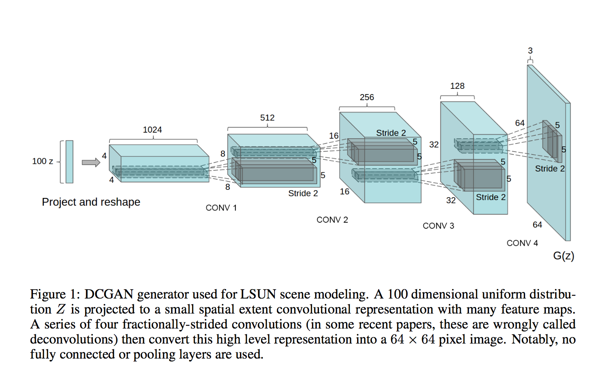

# Deep Convolutional Generative Adversarial Networks - DCGANs


This project implements the paper [Unsupervised Representation Learning with Deep Convolutional Generative Adversarial Networks](http://arxiv.org/abs/1511.06434) from a porting of [pytorch/examples/dcgan](https://github.com/pytorch/examples/tree/master/dcgan) making it usables on [FloydHub](https://www.floydhub.com/).

The implementation is very close to the Torch implementation [dcgan.torch](https://github.com/soumith/dcgan.torch).

Before start, the `fixed_noise.pth` (serialized Z vector used for generating image on training) is saved in the `outf` folder.

After every 100 training iterations, the files `real_samples.png` and `fake_samples.png` are written to disk
with the samples from the generative model.

After every epoch, models are saved to: `netG_epoch_%d.pth` and `netD_epoch_%d.pth`

## Downloading the LSUN dataset
You can download the LSUN dataset by cloning [this repo](https://github.com/fyu/lsun) and running
```bash
python download.py -c bedroom
```

## Usage

Training script:

```bash
usage: main.py [-h] --dataset DATASET --dataroot DATAROOT [--workers WORKERS]
               [--batchSize BATCHSIZE] [--imageSize IMAGESIZE] [--nz NZ]
               [--ngf NGF] [--ndf NDF] [--niter NITER] [--lr LR]
               [--beta1 BETA1] [--cuda] [--ngpu NGPU] [--netG NETG]
               [--netD NETD]

optional arguments:
  -h, --help            show this help message and exit
  --dataset DATASET     cifar10 | lsun | imagenet | folder | lfw
  --dataroot DATAROOT   path to dataset
  --workers WORKERS     number of data loading workers
  --batchSize BATCHSIZE
                        input batch size
  --imageSize IMAGESIZE
                        the height / width of the input image to network
  --nz NZ               size of the latent z vector
  --ngf NGF
  --ndf NDF
  --niter NITER         number of epochs to train for
  --lr LR               learning rate, default=0.0002
  --beta1 BETA1         beta1 for adam. default=0.5
  --cuda                enables cuda
  --ngpu NGPU           number of GPUs to use
  --netG NETG           path to netG (to continue training)
  --netD NETD           path to netD (to continue training)
```

Generating script:

```bash
usage: generate.py [-h] --netG NETG [--outf OUTF] [--Zvector ZVECTOR] [--cuda]
                   [--ngpu NGPU]

optional arguments:
  -h, --help         show this help message and exit
  --netG NETG        path to netG (for generating images)
  --outf OUTF        folder to output images
  --Zvector ZVECTOR  path to Serialized Z vector
  --cuda             enables cuda
  --ngpu NGPU        number of GPUs to use
```

## DCGAN Architecture



## Run on FloydHub

Follow the tutorial on the [FloydHub docs](http://docs.floydhub.com/examples/dcgan/) or follow the next steps:

### Project Setup

Before you start, log in on FloydHub with the [floyd login](http://docs.floydhub.com/commands/login/) command, then fork and init the project:

```bash
$ git clone https://github.com/floydhub/dcgan.git
$ cd dcgan
$ floyd init dcgan
```

### Training

This project support the following datasets which were used in the paper:
- [LSUN](http://www.yf.io/p/lsun), coming soon on FloydHub Dataset, but you can download it following the above command
- [CIFAR-10](https://www.cs.toronto.edu/~kriz/cifar.html), available on FloydHub [here](https://www.floydhub.com/search/datasets?query=cifar)
- [ImageNet](http://www.image-net.org/), available on FloydHub [here](https://www.floydhub.com/search/datasets?query=imagenet)
- [LFW](http://vis-www.cs.umass.edu/lfw/), available on FloydHub [here](https://www.floydhub.com/search/datasets?query=lfw)
- Custom Image Dataset Folder, now it's your turn to make new experiments :)

Now it's time to run our training on FloydHub. In this example we will train the model for 100 epochs with a gpu instance and with cuda enabled.
**Note**: If you want to mount/create a dataset look at the [docs](http://docs.floydhub.com/guides/basics/create_new/#create-a-new-dataset).

```bash
$ floyd run --gpu --env pytorch-0.2  --data redeipirati/datasets/lfw/1:lfw "python main.py --dataset lfw --dataroot /lfw --outf /output --cuda --ngpu 1 --niter 100
```
You can follow along the progress by using the [logs](http://docs.floydhub.com/commands/logs/) command.
The training should take about 2h!!

### Evaluating

It's time to evaluate our model generating some images:

```bash
floyd run --gpu --env pytorch-0.2  --data <REPLACE_WITH_JOB_OUTPUT_NAME>:/model "python generate.py --netG /model/<REPLACE_WITH_MODEL_CHECKPOINT_PATH> --ngpu 1 --cuda"

# Provide a serialized Zvector
floyd run --gpu --env pytorch-0.2  -data <REPLACE_WITH_JOB_OUTPUT_NAME>:/model "python generate.py --netG /model/<REPLACE_WITH_MODEL_CHECKPOINT_PATH> --Zvector <REPLACE_WITH_SERIALIZED_Z_VECTOR_PATH> --ngpu 1 --cuda"
```

### Try our pre-trained model

We have provided to you a pre-trained model trained on the lfw-dataset for about 300 epochs.

```bash
floyd run --gpu --env pytorch-0.2  --data redeipirati/datasets/dcgan-300-epochs-models/1:/model "python generate.py --netG /model/netG_epoch_299.pth --ngpu 1 --cuda"
```

### Serve model through REST API

FloydHub supports seving mode for demo and testing purpose. Before serving your model through REST API,
you need to create a `floyd_requirements.txt` and declare the flask requirement in it. If you run a job
with `--mode serve` flag, FloydHub will run the `app.py` file in your project
and attach it to a dynamic service endpoint:


```bash
floyd run --gpu --mode serve --env pytorch-0.2  --data <REPLACE_WITH_JOB_OUTPUT_NAME>:input
```

The above command will print out a service endpoint for this job in your terminal console.

The service endpoint will take a couple minutes to become ready. Once it's up, you can interact with the model by sending serialized Z vector file with a POST request or simply generating images from random noise:

```bash
# e.g. of a GET req
curl -X GET -o <NAME_&_PATH_DOWNLOADED_IMG> -F "ckp=<MODEL_CHECKPOINT>" <SERVICE_ENDPOINT>
curl -X GET -o prova.png -F "ckp=netG_epoch_99.pth" https://www.floydhub.com/expose/BhZCFAKom6Z8RptVKskHZW

# e.g. of a POST req
curl -X POST -o <NAME_&_PATH_DOWNLOADED_IMG> -F "file=@<ZVECTOR_SERIALIZED_PATH>" <SERVICE_ENDPOINT>
curl -X POST -o prova.png -F "file=@./parameter/zvector.pth" https://www.floydhub.com/expose/BhZCFAKom6Z8RptVKskHZW
```

Any job running in serving mode will stay up until it reaches maximum runtime. So
once you are done testing, **remember to shutdown the job!**

*Note that this feature is in preview mode and is not production ready yet*

## More resources

Some useful resources on DCGAN:

- [DCGAN slide](https://www.slideshare.net/enakai/dcgan-how-does-it-work)
- [Paper explained](https://medium.com/@liyin_27935/dcgan-79af14a1c247)
- [Quora GAN](https://www.quora.com/What-are-Generative-Adversarial-Networks-GANs)
- [OpenAI GAN](https://blog.openai.com/generative-models/)
- [Ian Goodfellow, Research Scientist OpenAI : Generative Adversarial Networks](https://youtu.be/HN9NRhm9waY)

## Contributing

For any questions, bug(even typos) and/or features requests do not hesitate to contact me or open an issue!
